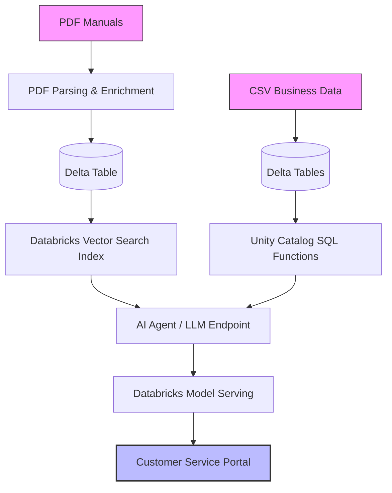

# 🚀 Enterprise Knowledge Agent — Databricks Customer Service Assistant

<!-- Centered Badges Block -->
<p align="center">
  
  
  
</p>

---

## 📖 Overview

An end-to-end **Enterprise Knowledge + Agentic AI** solution built on **Databricks** that combines structured enterprise data and unstructured product documentation to support grounded customer-service interactions. 

The project ingests CSVs and PDF manuals, builds governed knowledge in **Unity Catalog**, enables semantic retrieval through **Databricks Vector Search**, exposes structured data through **Unity Catalog SQL functions**, and connects the AI serving layer to a full-stack customer-service portal.

### 💡 Project Explanation
Customer-service teams often need information from different systems: product manuals, product metadata, company policies, and historical customer-service records. This project brings those sources into a single Databricks-based knowledge architecture.

| Knowledge Type | Data | Implementation |
| :--- | :--- | :--- |
| **Unstructured KB** | Product manuals and documentation | PDF parsing → enrichment → Delta table → Vector Search |
| **Structured KB** | Products, policies, customer-service data | CSV ingestion → Delta tables → Unity Catalog SQL functions |

The two knowledge paths are designed to work together so semantic retrieval can answer documentation-heavy questions while governed SQL functions provide deterministic business lookups.

---

## 📐 Architecture & Workflow

The architecture handles unstructured data via Vector Search and structured business logic through Unity Catalog User Defined Functions (UDFs). Both pipelines merge into the Model Serving layer to feed the client dashboard.



---

## 🛠️ Technology Stack & Tools

| Component | Technology / Tools Used |
| :--- | :--- |
| **Data Ingestion** | PySpark, Python, `pypdf` |
| **Storage & Governance** | Delta Lake, Unity Catalog |
| **Structured KB** | Delta tables, Unity Catalog SQL functions |
| **Unstructured KB** | Databricks Vector Search |
| **Retrieval** | Hybrid Search |
| **AI Layer** | Databricks AI / Agent endpoint |
| **Serving** | Databricks Model Serving |
| **Frontend** | React, TypeScript |
| **Backend** | Express.js, TypeScript |
| **Persistence** | Lakebase / PostgreSQL *(optional)* |
| **Evaluation** | MLflow feedback *(optional)* |
| **Deployment** | Databricks Apps, Databricks Asset Bundles (DAB) |

---

## 📁 Project Structure

```text
enterprise-knowledge-agent/
│
├── Notebooks/
│   ├── 01_Parse_PDF_Docs.py       # Parse PDFs → Delta table
│   ├── 02_Load_CSV_files.py       # Load CSVs → Delta tables
│   ├── 03_Enriched_Docs.py        # Join metadata + product documentation
│   ├── 04_Query_VS_Index.py       # Query Vector Search index
│   └── 05_Create_UDF.py           # Create Unity Catalog SQL tools
│
├── Source_Data/
│   ├── cust_service_data.csv      # Customer-service data
│   ├── policies.csv               # Business policy data
│   └── product_docs/
│       └── *.pdf                   # Product documentation
│
├── apps/
│   └── customer-service-portal/
│       ├── client/                 # React frontend
│       ├── server/                 # Express / TypeScript backend
│       ├── packages/               # Shared application packages
│       ├── tests/                  # Playwright E2E tests
│       ├── scripts/                # Application utilities
│       ├── app.yaml                # Databricks App runtime config
│       ├── databricks.yml          # Asset Bundle configuration
│       └── package.json            # Node dependencies and scripts
│
└── README.md
```

---

## 🚀 Quick Start

### 📋 Prerequisites
Ensure you have the following environments and configurations configured:
- [ ] **Databricks workspace** with Unity Catalog enabled
- [ ] **Databricks CLI** installed and authenticated locally
- [ ] Running Databricks compute for notebook execution
- [ ] Pre-existing **Vector Search endpoint and index**
- [ ] Databricks AI / model serving endpoint for the portal
- [ ] **Node.js 18+** and **npm 8+**

### 💻 Deploy & Run

1. **Clone the repository:**
   ```bash
   git clone https://github.com/Yashvi1713/enterprise-knowledge-agent.git
   cd enterprise-knowledge-agent
   ```

2. **Upload Source Assets:**
   Upload your raw CSVs and PDFs to your configured Unity Catalog Volume:
   ```text
   /Volumes/<catalog>/<schema>/<volume>/
   ```

3. **Execute Core Pipeline Notebooks:**
   Run the Databricks notebooks inside your workspace in sequential order:
   - `01_Parse_PDF_Docs.py`
   - `02_Load_CSV_files.py`
   - `03_Enriched_Docs.py`
   - `04_Query_VS_Index.py`
   - `05_Create_UDF.py`

4. **Boot Up Customer Service Portal:**
   ```bash
   cd apps/customer-service-portal
   npm install
   cp .env.example .env
   npm run dev
   ```

### 📦 Deploying via Databricks Asset Bundles (DAB)

```bash
# Authenticate your terminal session
databricks auth login

# Validate your bundle configurations
databricks bundle validate

# Deploy your workspace cloud resources
databricks bundle deploy --var serving_endpoint_name="<your-serving-endpoint>"

# Launch the app engine resource
databricks bundle run databricks_chatbot
```

> ⚠️ **Note:** Vector Search provisioning and AI serving-endpoint configurations are currently managed outside the notebook pipeline.

---

## 🤖 Agent Routing Tools

The knowledge layer provides semantic routing filters for structural data queries rather than evaluating every input string exclusively as an unstructured vector problem.

| Tool | Type | Description |
| :--- | :--- | :--- |
| **Product Documentation Search** | Vector Search Retriever | Searches enriched product documentation for setup guidance, specs, and troubleshooting context. |
| `get_return_policy` | UC SQL Function | Retrieves precise policy details for a requested corporate policy query. |
| `get_service_history` | UC SQL Function | Extracts custom historical context for targeted customer-specific service requests. |

---

## ⚙️ Configuration Adjustments

### 📝 Parameterized Notebook Variables
Settings are dynamically controlled inside your environment using Databricks widgets:

| Variable | Default | Description |
| :--- | :--- | :--- |
| `catalog` | `agentic_catalog` | Targets the designated Unity Catalog catalog space |
| `schema` | `agentic_schema` | Targets the active environment schema |
| `volume` | `customer_service` | Managed volume context housing internal source files |

### 🔍 Vector Search Config Parameters

| Setting | Current Value |
| :--- | :--- |
| **Endpoint** | `products_vector_search_endpoint` |
| **Index** | `agentic_catalog.agentic_schema.product_docs_index` |
| **Search Type** | `HYBRID` |

> 🔒 **Security Notice:** Vector Search secrets (`WORKSPACE_URL`, `SP_CLIENT_ID`, `SP_CLIENT_SECRET`) should be read cleanly from your local environment setup. Never commit raw credentials into version control.

### 🌐 Portal Application Ecosystem

| Target Element | System Strategy |
| :--- | :--- |
| **Runtime Engine** | Node.js 20 |
| **Serving Endpoint** | Dynamic string injected through `serving_endpoint_name` |
| **DAB Deploy Targets** | `dev` \| `staging` \| `prod` |
| **Chat Persistence** | Optional instance layer using Lakebase / PostgreSQL |
| **Feedback Metric Evaluation** | Optional tracking setups leveraging MLflow assessments |

---

## 🔄 Idempotency & Repeatability

The implementation layers utilize strictly repeatable write patterns, ensuring core pipelines can safely execute without duplicating resources or requiring manual database deletion steps.

| Component Component | Idempotent Logic Patterns |
| :--- | :--- |
| **PDF Documentation** | Written using `.mode("overwrite")` + `overwriteSchema` rules |
| **CSV Data Pipelines** | Recreated automatically using `.mode("overwrite")` setups |
| **Enriched Documents** | Rebuilt continuously across execution triggers via overwrite patterns |
| **UC SQL Functions** | Rebuilt cleanly using declarative `CREATE OR REPLACE FUNCTION` scripts |
| **Change Data Tracking** | Native Delta Change Data Feed mechanics tracking target mutations |
| **App Bundle Deployments** | Infrastructure maps dynamically addressed across isolated DAB targets |

---

## 🤝 Acknowledgements & Contributions
* **Base Blueprint Layout:** The customer-service portal application is adapted from the core **Databricks Agent Chat application template** and is extended to handle multi-tiered enterprise data lookups.
